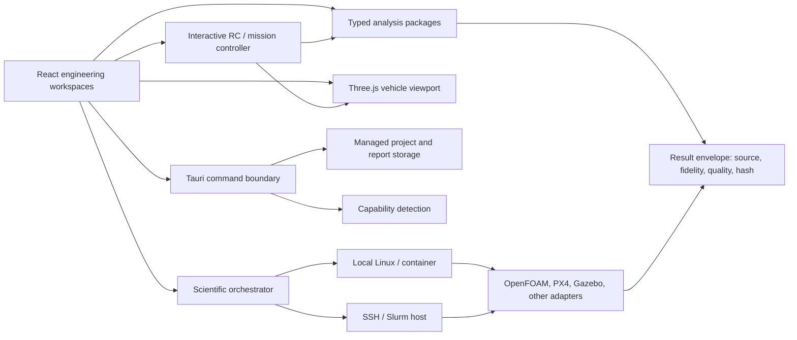

# Architecture

Aerocel Forge separates deterministic engineering models from presentation and
from external process execution. That boundary keeps browser previews useful,
native filesystem access narrow, and solver provenance auditable.

## Trust boundaries

The webview does not execute arbitrary shell text. Tauri commands accept typed
arguments and restrict persistence to an application-managed directory. External
solver commands are arrays created by adapters, their working directory must be
inside a configured case root, and the orchestrator streams actual process output
rather than estimated progress.

Remote credentials are not part of the project schema. Use an SSH agent and
host aliases. Diagnostics redact home paths, user names, bearer tokens, and common
secret assignments before export.

## Data flow and reproducibility

1. The versioned project schema validates components, joints, propulsion,
   battery, provenance, and quality metadata.
2. A model consumes explicit SI inputs and produces a result envelope.
3. The envelope records model identity, fidelity, timestamp, warnings, and an
   input hash. A changed hash marks the result stale.
4. External jobs add executable/version, case path, command stages, convergence,
   and output manifest data.
5. Reports include the same manifest; they do not silently upgrade result quality.

The canonical vehicle frame is body FRD (x forward, y right, z down). World
dynamics use NED. Three.js rendering converts to FLU/ENU only at the display
boundary. Angles are radians internally and SI is the computational unit system.

The interactive Flight Lab runs a deterministic 60 Hz fixed-step controller and
six-degree-of-freedom loop in the webview. Pointer, keyboard, and Gamepad API
inputs become bounded normalized pilot channels. The behavior editor compiles a
small declarative mission grammar into typed targets and waypoints; it does not
evaluate user code. The vehicle render, trail, HUD, force telemetry, and battery
state all consume the same integrated state.

## Fidelity model

Propulsion levels are P0 simple source, P1 manufacturer table, P2 blade-element
momentum, and P3 CFD actuator disk. Aerodynamics currently implements A1
attached-flow parabolic polar and explicit external boundaries for higher fidelity.
A quality grade is independent from fidelity: a high-fidelity run can still fail
because it diverged, lacks a mesh study, or violates its input domain.

## Package boundaries

- `simulation-schema`: durable project contract and migrations.
- `unit-system`, `math-core`: dimensional and coordinate invariants.
- `geometry-core`: topology, volume, mass/inertia, preliminary beam model.
- `propulsion-models`, `aero-models`, `flight-dynamics`: physics kernels.
- `solver-adapters`: execution contracts, case plans, PX4/remote validation.
- `result-models`: convergence, GCI, uncertainty, staleness, provenance.
- `optimization`, `report-generator`: exploration and auditable output.
