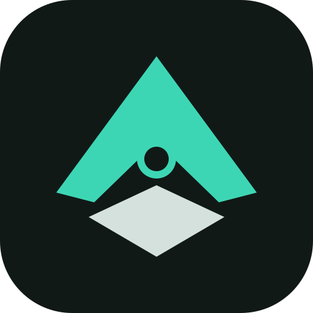

<div align="center">
  
  <h1>Aerocel Forge</h1>
  <p><strong>Design, inspect, test, and simulate aircraft and drones in one desktop app.</strong></p>
  <p>
    <a href="https://github.com/sitnug/aerocelforge/actions/workflows/ci.yml"></a>
    
    
  </p>
</div>

Aerocel Forge is a beginner-friendly engineering workspace for aircraft, UAV,
eVTOL, and tilt-rotor concepts. It combines 3D model import, part editing,
weight and balance, motors and batteries, fast airflow estimates, interactive
flight simulation, VTOL transition studies, route planning, and reports.

It opens in **Simple** mode with plain words and small help popups. Experienced
users can enable **Advanced** tools when they need more detail.

> [!IMPORTANT]
> Aerocel Forge is an engineering development aid, not flight-certified
> software. Software checks do not replace measured component data, wind-tunnel
> tests, hardware simulation, flight testing, or independent engineering review.

## What you can do

| Workspace      | What it does                                                                                   |
| -------------- | ---------------------------------------------------------------------------------------------- |
| **3D model**   | Import a part or a whole drone, inspect its size, move it, turn it, recolour it, or delete it. |
| **Parts**      | See the full assembly, parent/child links, joints, and movable parts.                          |
| **Weight**     | Calculate total mass, centre of gravity, and inertia from the current parts.                   |
| **Power**      | Edit motors, propellers, batteries, thrust, power, current, KV, pitch, and blade count.        |
| **Airflow**    | Run fast concept-level lift, drag, stability, span-load, and glide estimates.                  |
| **Fly**        | Fly the current model with on-screen sticks, a gamepad, or the keyboard.                       |
| **Transition** | Estimate hover-to-cruise behaviour, energy use, altitude change, and failure cases.            |
| **Route**      | Set flight targets or write a small, bounded waypoint program.                                 |
| **Results**    | Compare outputs, uncertainty, warnings, and quality grades.                                    |
| **Reports**    | Export readable engineering summaries and CSV data.                                            |

Other useful features include:

- Bright and Cockpit themes with high-contrast controls.
- Simple and Advanced modes.
- A resizable window, application fullscreen, and simulator Focus mode.
- Right-click editing and Delete/Backspace removal with relationship checks.
- Saved project data with a versioned schema and SI units internally.
- Honest capability gates for tools such as OpenFOAM, OpenVSP, PX4, and Gazebo.

## Quick start on macOS

The currently tested packaged target is **macOS 13 or later on Apple Silicon**.
A public build still needs Apple Developer ID signing and notarization, so the
most reliable current setup is to run it from source.

### Requirements

- macOS 13+
- Node.js 22+
- npm 10+
- Rust 1.77.2+
- Python 3.9+
- Xcode Command Line Tools (`xcode-select --install`)

### Run the desktop app

```bash
git clone https://github.com/sitnug/aerocelforge.git
cd aerocelforge
./scripts/bootstrap-macos.sh
npm run desktop
```

The included **Kestrel** example opens on first run. Its values are examples,
not measurements from a real aircraft.

### Run the browser preview

```bash
npm run dev
```

Open <http://127.0.0.1:1420>. The browser preview is useful for UI work, but it
uses browser storage instead of the native app's project-file storage.

### Build the Mac installer

```bash
npm run desktop:build
```

The app and DMG are written to:

```text
apps/desktop/src-tauri/target/release/bundle/
```

See [MACOS_SETUP.md](MACOS_SETUP.md) for signing, packaging, and troubleshooting.

## Import a 3D model

Open **File → Import model** or use **Import model** in the 3D workspace. Choose:

1. The file type, or **Auto-detect**.
2. The units used by the source file.
3. **One complete drone part** or **Whole drone model**.
4. A file from the picker, or drag it onto the drop zone.

Built-in import supports:

| Format     | Current support                                 |
| ---------- | ----------------------------------------------- |
| STL        | ASCII and binary triangle models                |
| OBJ        | Polygon models, including relative face indices |
| glTF / GLB | Self-contained scene models                     |
| PLY        | Common ASCII and binary triangle models         |
| DAE        | Embedded COLLADA geometry                       |
| DAT / CSV  | Airfoil or section inspection only              |

STEP, IGES, 3MF, VSP3, URDF, SDF, and DXF need their named external adapter.
Aerocel Forge shows them as unavailable instead of pretending an import worked.

Click any part in the left sidebar to open its settings. Motor thrust, battery
capacity, propeller size, wing dimensions, part weight, visibility, and colour
are linked to the calculations that use them.

## Fly the model

Open **Fly**, choose **Controller** or **Keyboard**, select a flight mode, and
press **Fly**.

### Keyboard controls

| Key   | Action            |
| ----- | ----------------- |
| W     | Pitch down        |
| S     | Pitch up          |
| A     | Bank left         |
| D     | Bank right        |
| Shift | Increase throttle |
| Ctrl  | Decrease throttle |
| Q / E | Change motor tilt |
| Space | Fly or pause      |

Controller mode accepts the two on-screen Mode 2 sticks or a standard gamepad.
Only the selected input type controls the aircraft, so a connected gamepad does
not overwrite keyboard input.

See [docs/FLIGHT_SIMULATOR.md](docs/FLIGHT_SIMULATOR.md) for flight modes,
waypoint commands, simulator physics, and known limits.

## Engineering quality and limits

Aerocel Forge records where results came from, which inputs created them, their
fidelity level, quality grade, and warnings. Missing external solvers do not
produce made-up CFD or SITL results.

The built-in airflow and flight tools are useful for early design comparisons.
They are not a calibrated digital twin. Real decisions require measured motor,
propeller, battery, mass, inertia, aerodynamic, actuator, and sensor data.

Read the current [production-readiness audit](PRODUCTION_READINESS.md),
[validation record](VALIDATION.md), and
[aerodynamics model notes](docs/AERODYNAMICS_MODEL.md) before relying on results.

## Development

### Main checks

```bash
npm run check
npm run python:check
npm run python:lint
npm run python:typecheck
npm run rust:check
npm run rust:clippy
cargo test --manifest-path apps/desktop/src-tauri/Cargo.toml
```

GitHub Actions runs the TypeScript, Python, and Rust checks for pushes and pull
requests.

### Technology

- React 19 and TypeScript 6
- Three.js and React Three Fiber
- Tauri 2 and Rust
- FastAPI scientific-process orchestrator
- Vitest, ESLint, Prettier, Ruff, mypy, Cargo test, and Clippy

### Repository map

```text
apps/desktop/                    React + Three.js + Tauri desktop app
packages/                        Engineering and data-model libraries
services/scientific-orchestrator Typed FastAPI process orchestrator
examples/kestrel/                Included tri-tilt example project
solvers/                         External solver contracts and setup notes
infrastructure/                  Local and remote solver templates
docs/                            User and technical documentation
```

## Documentation

- [User manual](docs/USER_MANUAL.md)
- [Developer guide](docs/DEVELOPER_GUIDE.md)
- [Architecture](ARCHITECTURE.md)
- [Flight simulator](docs/FLIGHT_SIMULATOR.md)
- [Aerodynamics model](docs/AERODYNAMICS_MODEL.md)
- [Solver adapters](docs/SOLVER_ADAPTERS.md)
- [Roadmap](ROADMAP.md)
- [Security policy](SECURITY.md)
- [Contributing](CONTRIBUTING.md)

## License

This repository does not currently include an open-source license. Until one is
added, the code remains under the default copyright rules.
